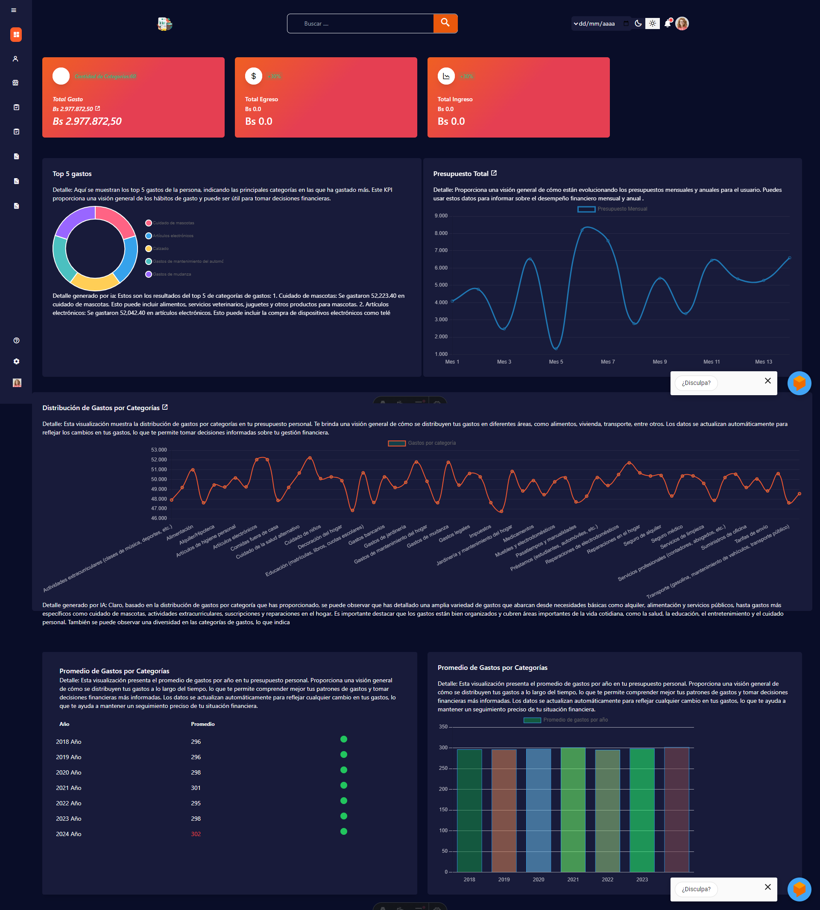
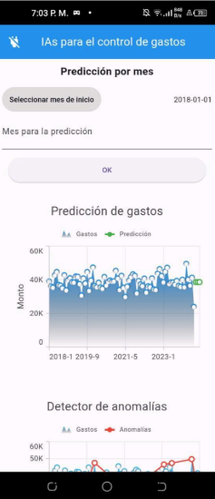
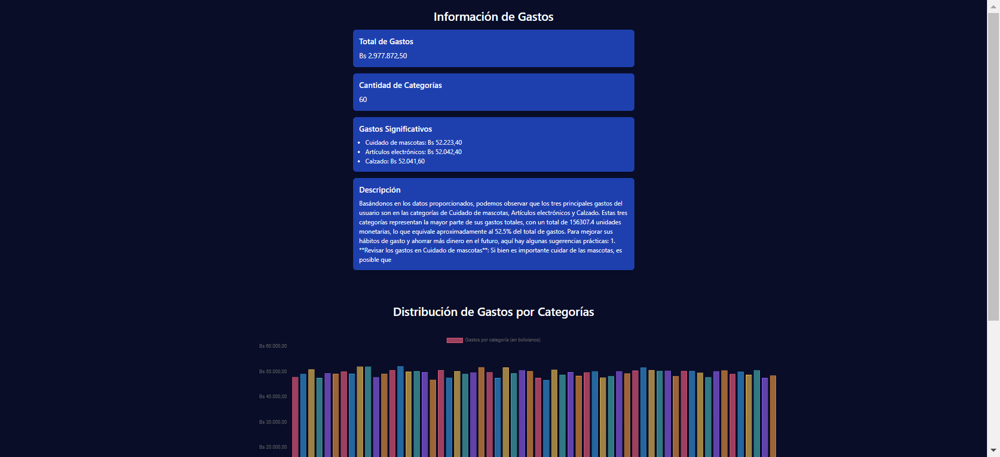
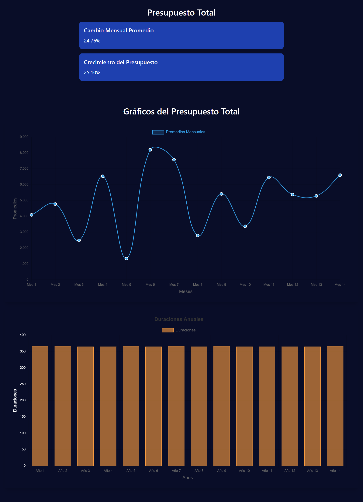

# Proyecto de Presupuesto

Este proyecto es una aplicación para gestionar presupuestos que integra diversas tecnologías y servicios.



## Documentación

- [Documento del Proyecto](https://onedrive.live.com/personal/a711140c86bb0b01/_layouts/15/doc2.aspx?resid=91e30277-a302-46e2-b768-efd278c8b18b&cid=a711140c86bb0b01&ct=1718249250172&wdOrigin=OFFICECOM-WEB.START.UPLOAD&wdPreviousSessionSrc=HarmonyWeb&wdPreviousSession=03650ba1-e649-4fff-bc38-75877f6c3576)
- [Manual de Usuario de la App](https://firebasestorage.googleapis.com/v0/b/imagenes-972f4.appspot.com/o/presupuesto%2FMovilManualdeUsuario.docx.pdf?alt=media&token=3484c8ee-b538-4f5a-83b0-b2a10a5691ca)

## Tecnologías Utilizadas

### Chatbot
- **Dialogflow**: Utilizado para el bot.

### Frontend
- **Astro-React**

### Dashboard
- **Python Flask**: Inteligencia de negocio dashboard

### App Móvil
- **Flutter**: Integración con la IA

### Backend
- **Spring Boot**: Backend principal con GraphQL

### Base de Datos
- **MongoDB**: Utilizado con Spring Boot
- **MySQL**: Utilizado con Laravel y Express

### Gestión de Archivos
- **Gestor de Archivos en la Base de Datos**

### Contenedores
- **Docker**

### Nube
- **Oracle**
- **Railway**

## Repositorios y Herramientas

- **Repositorio en GitHub**: [swpresupuesto-ia](https://github.com/Pericena/swpresupuesto-ia)
- **Gestión de Proyecto en Jira**: [PPIS en Jira](https://andresintel773.atlassian.net/jira/software/projects/PPIS/boards/3)

## Descargas

- [Descargar la App](https://drive.google.com/file/d/1ezbsAwMqPHzvZD14QJBCWuZ0PcnHwmIL/view)

## Imágenes del Proyecto

 <!-- Reemplazar con la URL de tu imagen -->
*Interfaz principal de la aplicación*



 <!-- Reemplazar con la URL de tu imagen -->
*Vista del dashboard de inteligencia de negocio*

## Contribución
Clona el repositorio:
    ```bash
    git clone https://github.com/Pericena/swpresupuesto-ia.git
    ```


## Equipo

- **Oscar Oros**
- **Luishiño Pericena**
- **Jose Chile**


---

Si tienes alguna pregunta o comentario, por favor abre un issue en el repositorio o contacta a uno de los miembros del equipo.